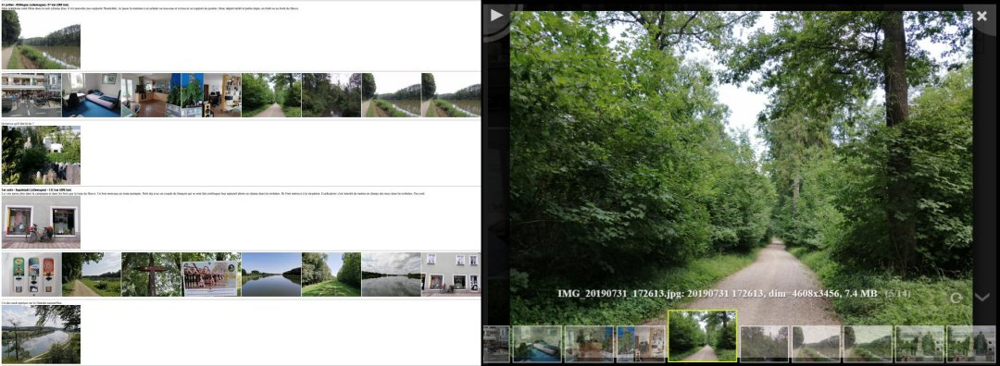

# galerie

#  [](https://opensource.org/licenses/MIT) [](https://travis-ci.org/GillesArcas/galerie) [](https://coveralls.io/github/GillesArcas/galerie?branch=master)

# Description

*galerie* est un utilitaire en ligne de commande permettant de créer des galeries d'images et de vidéos sous la forme de pages HTML. Les images et vidéos peuvent être organisées par répertoires, par dates ou les deux. De plus, les galeries créées peuvent inclure le contenu d'un fichier journal. Un fichier journal est un fichier texte, respectant une syntaxe très simple (le format Markdown), organisé par dates et incluant du texte et des médias. Additionnellement, une galerie peut être exportée au format de la plate-forme Blogger.

- [Installation](#installation)
- [Utilisation](#utilisation)
- [Création d'une galerie](#création-dune-galerie)
- [Autres commandes](#autres-commandes)
- [Règles d'écriture d'un fichier journal](#règles-décriture-dun-fichier-journal)
- [Fichier de configuration](#fichier-de-configuration)
- [Crédits](#crédits)

# Installation

1. Télécharger l'archive de l'application :

https://github.com/GillesArcas/galerie/archive/master.zip

2. Décompresser dans un répertoire
3. Ouvrir une console dans ce répertoire et lancer la commande suivante :

```
pip install .
```

Noter que [ffmeg](https://ffmpeg.org/) doit être installé et dans le chemin.

# Utilisation

## Génération d'une galerie

La principale utilisation de *galerie* est la création de galeries à partir de répertoires de médias. Ceci se fait en ligne de commande, par exemple avec la commande suivante :

`$ galerie --gallery /foo/mygallery --sourcedir /bar/mypictures`

Cette commande crée dans le répertoire /foo/gallery un fichier HTML index.htm qu'il faut ouvrir pour visionner la galerie. Toutes les options de création sont décrites dans la suite.

Toutes les options peuvent être abrégées si elles ne créent pas d'ambiguïté. Ainsi,

`$ galerie --gallery /foo/mygallery --sourcedir /bar/mypictures --recursive`

est équivalent à

`$ galerie --gal /foo/mygallery --source /bar/mypictures --rec`

## Navigation dans une galerie

Après avoir ouvert le fichier index.htm dans un navigateur, une page de vignettes est affichée. Si on clique sur une des vignettes, les vignettes sont remplacées par la visualisation de l'image cliquée. L'image peut être zoomée ou orientée. En mode visualisation, on peut également passer d'une image à une autre et les images peuvent être enchainées en diaporama.



# Création d'une galerie

## Présentation

Une galerie est créée avec la commande `--gallery`. Cette commande, suivie du nom du répertoire racine de la galerie, peut nécessiter de donner le nom du répertoire source des médias avec l'option `--sourcedir`.

`$ galerie --gallery /foo/bar/mygallery --sourcedir /spam/egg/mypictures`

Il y a trois façons d'organiser une galerie à partir des médias contenus dans un répertoire :

* on peut conserver la structure de sous-répertoire, en créant une page par sous-répertoire, avec l'option `--bydir`,
* on peut regrouper les médias par dates, en créant une section par date ayant la date pour titre, avec l'option `--bydate`,
* on peut utiliser un ficher journal avec l'option `--diary`. Un fichier journal est un fichier de syntaxe simple, organisé par date et associant à chaque date un texte et des images ou des vidéos. Une page peut être créée avec seulement ces données ou complétée avec les médias d'un répertoire source.

Les options `--bydir` et `--bydate` peuvent être combinées. Deux options supplémentaires permettent de préciser les données utilisées avec les options `--bydir`, `--bydate`  et `--diary`:

* l'option `--dates` qui limite les médias utilisés dans une galerie à une sélection de dates,
* l'option `--recursive` qui indique si il faut considérer les sous-répertoires du répertoires source.

L'option `--github_pages` permet de générer une galerie compatible avec l'hébergement github Pages.

Finalement, une fois la galerie créée, il suffit d'utiliser la commande `--update` pour mettre à jour une galerie avec les options qui ont permis de la créer.

## Quelques exemples

Création d'une galerie organisée par sous-répertoires :

`$ galerie --gallery /foo/mygallery --sourcedir /bar/mypictures --bydir true`

Création d'une galerie organisée par date, en limitant les dates à une plage et en incluant les sous-répertoires :

`$ galerie --gallery /foo/mygallery --sourcedir /bar/mypictures --bydate true --dates 20200701-20200731 --recursive true`

Création d'une galerie organisée par dates et sous-répertoires :

`$ galerie --gallery /foo/mygallery --sourcedir /bar/mypictures --bydate true --bydir true`

Mise à jour d'une galerie en utilisant les options qui ont permis de la créer :

`$ galerie --update /foo/mygallery`

Des exemples de galeries créées à partir des données utilisées pour les tests d'intégration continue sont données [ici](file:///D:/Gilles/github.io/galerie/examples.html).

## Description complète des options de création de galeries

L'option `--gallery` permet de créer et mettre à jour une galerie. La galerie est définie par les options `--sourcedir`, `--bydir`, `--bydate`, `--diary`, `--dates`, `--recursive` et `--github_pages`. La commande `--update` permet de remplacer les sept options précédentes.

`--gallery <chemin de répertoire>`

spécifie le répertoire racine de la galerie. Dans ce répertoire se trouvent l'ensemble des fichiers créés. Le point d'entrée est le fichier `index.htm`.

`--sourcedir <chemin de répertoire>`

spécifie le répertoire où se trouve les médias à inclure dans la galerie. Cette option est facultative si on utilise l'option `--diary`. Dans ce cas, on peut en effet n'inclure que les médias spécifiés dans le fichier journal.

`--bydir true|false` (défaut `false`)

détermine si la galerie est organisée par répertoire et sous-répertoire, une page HTML par répertoire. Peut-être combiné avec `--bydate`.

`--bydate true|false` (défaut `false`)

détermine si la galerie est organisée par dates. Peut-être combiné avec `--bydir`.

`--diary true|false` (défaut `false`)

détermine si la galerie est organisée à partir d'un fichier journal.

`--dates diary|source|yyyymmdd-yyyymmdd` (défaut `source`)

spécifie les dates à considérer pour ajouter les médias d'un répertoire source à un fichier journal. Si l'argument vaut `diary`, on n'ajoute que les médias correspondant aux dates du fichier journal. Si l'argument vaut `source`, on ajoute tous les médias du répertoire source. Sinon, on n'ajoute que les médias dans une plage de dates qui doit être au format `yyyymmdd-yyyymmdd`.

`--recursive true|false` (défaut `false`)

Quand on crée une galerie à partir d'in fichier journal et d'un répertoire de médias, il est peur être envisagé d'utiliser également les médias contenus dans les sous-répertoires. Ceci se fait en donnant la valeur `true` à l'option `--recursive`.

`--github_pages true|false` (défaut `false`)

permet de générer une galerie compatible avec github Pages.

`--dest <chemin de répertoire>`

spécifie le répertoire de destination des fichiers générés (fichiers HTML et vignettes) à la place du répertoire racine (valeur de l'option `--gallery`). Attention, ceci ne copie pas le fichier journal ni les médias qui pourraient se trouver dans le répertoire racine.

`--forcethumb`

force le calcul des vignettes (ce qui est évité par défaut pour gagner en efficacité). Ceci est par exemple nécessaire si on modifie le paramètre `thumbdelay` du fichier de configuration (ce paramètre permet de spécifier l'instant de prise de vue de la vignette d'une vidéo).

# Autres commandes

L'utilitaire propose également les commandes suivantes :

`--create <chemin de répertoire> --sourcedir <chemin de répertoire> --dates <spec_date> --recursive true|false`

crée un fichier journal en considérant les médias spécifiés par les options `--sourcedir`, `--dates` et `--recursive` avec un comportement identique à celui rencontré pour la commande `--gallery`. Le fichier journal est initialisé avec un texte réduit aux dates des médias considérés.

`--blogger <chemin de répertoire> --url <url> [--check] [--full]`

exporte le journal contenu dans le répertoire au format Blogger. L'url doit pointer sur une page affichant les mêmes images que le fichier journal. Ceci est imposé par le fait qu'il n'est pas possible d'uploader des images sur Blogger par programme. La page Blogger est générée dans le presse-papier. L'option `--check` force une comparaison des images locales et sur Blogger (utile dans le cas où des images de même nom auraient pu changer de contenu). L'option `--full` copie dans le presse-papier une page HTML complète ce qui permet de la sauver et de la tester localement.

`--resetcfg`

remet le fichier de configuration dans sa configuration par défaut.

# Règles d'écriture d'un fichier journal

Un fichier journal est un fichier texte respectant le format Markdown avec les quelques contraintes listées ci-dessous. Ces contraintes permettent de structurer le journal.

Le nom d'un fichier journal doit être `index.md` et il doit être situé dans le répertoire racine (valeur de l'option `--gallery`).

### Structure d'un fichier journal

La première ligne d'un fichier journal est considérée comme son titre si elle commence par un caractère dièse "#". Un fichier journal est ensuite constitué d'enregistrements. 

### Structure d'enregistrement

Un enregistrement est constitué dans cet ordre de :

* un champ date obligatoire,
* un champ texte,
* un champ médias,
* un séparateur d'enregistrement.

### Le champ date

Le champ date doit apparaitre seul en première ligne de l'enregistrement avec le format suivant :

[2020/11/06]

Si la date est absente, la lecture du fichier journal déclenche une erreur. Une erreur est également déclenchée si les dates ne sont pas en ordre croissant. Des enregistrements différents peuvent avoir la même date.

Le champ date est ignoré par les fonctions d'exportation. Il est par contre nécessaire pour associer les médias d'un répertoire à chaque enregistrement.

### Le champ texte

Le champ texte doit respecter la syntaxe Markdown sans autre contrainte.

### Le champ médias

Deux types de média sont pris en compte : les images et les vidéos. Les images (au format JPEG) sont spécifiées avec le format ![]\(\) standard:

 ``

 Les vidéos (au format MP4) sont spécifiées avec la syntaxe des liens Markdonwn : 

`[](une_video.mp4)`

Dans les deux cas, les crochets doivent restés vide (pas de texte alt ou de texte de lien). Ces spécifications sont regroupées en fin d'enregistrement, un média par ligne en début de ligne. Si la ligne qui suit un média  n'est pas un média, elle est considérée comme une légende (texte lié au média apparaissant en dessous) par les fonctions d'exportation.

Un éventuel texte après les médias est ignoré.

### Séparateur d'enregistrements

Un séparateur d'enregistrement est une barre de séparation de trois caractères soulignés ("_", ASCII 95) au moins.

# Fichier de configuration

Un fichier de configuration permet de configurer certaines propriétés d'une galerie. Ce fichier se nomme `.config.ini` et se situe dans le répertoire racine de la galerie. Ce fichier est organisé en trois sections :

- la section `[source]` qui reprend les options de création données en ligne de commande (`--sourcedir`, `--bydir`, `--bydate`, `--diary`, `--dates`, `--recursive` et `--github_pages`). Cette section contient les valeurs utilisées quand on utilise la commande `--update`.

  **Note** : Les valeurs des paramètres de configuration de la section `[source]` ne sont utilisés qu'avec la commande `--update`. Ils ne viennent pas en défaut d'un paramètre absent si `--update` n'est pas utilisé.

- la section `[thumbnails]` qui permet de spécifier quelques paramètres d'affichage et de création des vignettes (affichage des méta-données, affichage des noms de répertoire, instant de capture des vignettes pour les vidéos, nombre maximum de vignettes à supprimer sans confirmation de l'utilisateur),

- la section `[photobox]` qui reprend les paramètres du module tiers Photobox qui affiche les médias unitairement.

Le fichier de configuration est auto-documenté et donne pour chaque paramètre une brève description ainsi que les valeurs qu'il peut prendre.

# Crédits

Le mode visualisation utilise le module Photobox de Yair Even Or (https://github.com/yairEO/photobox).

