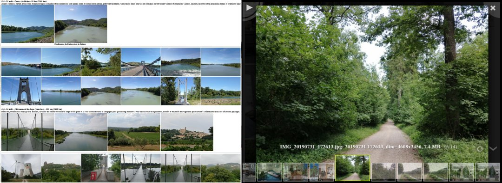

# galerie

#    

# Description

*galerie* is a command line utility generating HTML galleries from media directories. Images and videos can be organized by dates, by directories, by both or by
the content of a diary file. A diary file is a markdown file organized by
dates, each day being described by a text and some medias (photos and movies). 

- [Installation](#installation)
- [Usage](#usage)
- [Creation of a gallery](#creation-of-a-gallery)
- [Other commands](#other-commands)
- [Format of a diary file](#format-of-a-diary-file)
- [Configuration file](#configuration-file)
- [Credits](#credits)

# Installation

1. Download the archive at:

   https://github.com/GillesArcas/galerie/archive/master.zip

2. Unzip in some directory.

3. Open a console window in this directory and launch the following command:

   `pip install .`

Note that  [ffmeg](https://ffmpeg.org/) must be installed and in the path.

# Usage

## Making a gallery

Main usage of *galerie* is the creation of galleries from media directories. This is done from the command line, for instance with the following command:

`$ galerie --gallery /foo/mygallery --sourcedir /bar/mypictures`

This creates in the /foo/gallery directory an HTML file named index.htm. Open this file with any internet browser to navigate in the gallery. All creating options are described next.

Note that all options may be abbreviated as long as there is no ambiguity. As a consequence:

`$ galerie --gallery /foo/mygallery --sourcedir /bar/mypictures --recursive`

is equivalent to:

`$ galerie --gal /foo/mygallery --source /bar/mypictures --rec`

## Navigating inside a gallery

Wen browsing the gallery, a page of thumbnails is displayed. When clicking on a thumbnail, the thumbnails is replaced  by a full display of the clicked image. The image can be oriented or zoomed. It is also possible to navigate from one image to the other or visualize the images in slide-show mode.

# Creation of a gallery

## Presentation

A gallery is created with the `--gallery` command. This command, followed by the name of the root directory of the gallery, requires to give the name of the media directory with the option `--sourcedir`.

`$ galerie --gallery /foo/bar/mygallery --sourcedir /spam/egg/mypictures`

There are three ways to organize the medias from a source directory:

* it is possible to copy the sub-directory structure by creating a web page for each sub-directory with the option `--bydir`,
* it is possible to organize the medias by dates, by creating a section for each date with the command `--bydate`,
* it is possible to include the content of a diary file with the `--diary` option. A diary file is a text file with a very simple syntax (Markdown) organized by dates, associating to each date some text and medias. A page can be extended by adding also the medias from some directory.

The options `--bydir` and `--bydate` can be combined. Two additional options enable to give more information about the data used with the options `--bydir`, `--bydate`  et `--diary`:

* the `--dates` option gives a range limiting the dates of the medias,
* the `--recursive` option specifies if the sub-directories must be included or not.

The option `--github_pages` enables to create a gallery compatible with github Pages.

Finally, after creating a gallery, it is sufficient to use the `--update` command to update a gallery with the options given to specify it.

## Some examples

Creation of a gallery organized by directories:

`$ galerie --gallery /foo/mygallery --sourcedir /bar/mypictures --bydir true`

Creation of a gallery organized by dates, limiting the dates to a given rank, and including sub-directories:

`$ galerie --gallery /foo/mygallery --sourcedir /bar/mypictures --bydate true --dates 20200701-20200731 --recursive true`

Creation of a gallery organized by dates and directories:

`$ galerie --gallery /foo/mygallery --sourcedir /bar/mypictures --bydate true --bydir true`

Update of gallery with the creation options:

`$ galerie --update/foo/mygallery`

Some exemples of galeries created with the test data used for continuous integration are given [here](https://gillesarcas.github.io/galerie/examples.html).

## Complete description of gallery creation options

The option `--gallery` enables to create galleries. A gallery is defined by the options `--sourcedir`, `--bydir`, `--bydate`, `--diary`, `--dates`, `--recursive` and `--github_pages`. The `--update` command enables to replace the seven  previous options.

`--gallery <directory path>`

specifies the root directory of the gallery. All the files created for the gallery are in this directory. The entry point of the gallery is by default the file `index.htm`.

`--sourcedir <directory path>`

specifies the directory where to find the medias to include in the gallery. This option is not mandatory when using the `--diary` option. In this case, it is possible to include only the medias specified in the diary file.

`--bydir true|false` (default `false`)

specifies whether the gallery is organized by directories, one HTML page for each directory. Can be combined with `--bydate`.

`--bydate true|false` (default `false`)

specifies whether the gallery is organized by dates. Can be combined with `--bydir`.

`--diary true|false` (default `false`)

specifies whether he gallery is organized using a diary file.

`--dates diary|source|yyyymmdd-yyyymmdd` (default `source`)

specifies the dates to considered when adding medias to a diary. If the value of the option is `diary`, only the medias at the dates of the diary are added. If the value is  `source`, all the medias from the source directory are added. Otherwise the value must have the format `yyyymmdd-yyyymmdd` and the added medias must be included in this range.

`--recursive true|false` (default `false`)

When creating a gallery from a diary and a media directory, it may be required to consider the medias contained in the sub-directories. This is done by using the `--recursive` option with value `true`.

`--github_pages true|false` (default `false`)

enables to generate a gallery compatible with github Pages.

`--dest <directory path>`

specifies the destination directory for all files generated by a galley (HTML files and thumbnails) instead of the root directory (value of option `--gallery`). Beware this does not copy the medias contained in the root directory.

`--forcethumb`

forces the calculus of thumbnails (not done by default to save time). This is necessary for instance when modifying the value of the parameter `thumbdelay` in the configuration file. This parameter specifies the time offset of the thumbnails in the video.

# Other commands

The utility proposes also the following commands.

`--create <directory path> --sourcedir <directory path> --dates <spec_date> --recursive true|false`

creates a diary file by considering the medias specified by the options `--sourcedir`, `--dates` and `--recursive` with the same behavior as for the command `--gallery`. The diary is initialized with a text limited to the dates of the considered medias.

`--resetcfg`

resets the configuration file to the factory content.

# Format of a diary file

A diary is a text file respecting the Markdown format with some constraints described hereafter. These constraints enable to give a structure to the diary.

The name of a diary file must be `index.md` and it must be located in the root directory (value of the `--gallery` command).

## Structure of a diary file

 The first line of the diary file is the title of the diary if it starts with a sharp character (#). After that, the diary is made of a collection of records.

## Structure of a record

A record is made of:

* an optional date field,
* a text field,
* a media field,
* a record separator.

## Date field

The date field is optional. When present, it must appear alone in the first line of the record. It must respect the following format:

[yyyy/mm/dd] (for instance [2020/02/07])

An error is launched if the dates are not ordered. Two different records may have the same date.

The date field is ignored by the export functions. However, it is required to associate the medias from the `--sourcedir` directory to each record. Images are associated to the first record with a given date.

## Text field

The text field must respect the Markdown syntax without any constraint.

## Media field

Two types of media are considered: images and videos. Images (in JPEG format) are specified with the usual Markdown notation:

 ``

The videos (in MP4 format) are specified with link notation:

 ``

In both cases, brackets must remain empty (no alt text or link description). These specifications are gathered at the end of th record, one per line, at the beginning of line. If the line following a media is not a media specification, it is considered as a caption (a text associated to the media displayed below it) by the export functions.

Any text following the media specifications is ignored.

## Record separator

A record separator is a horizontal rule made of three underscores ("_", ASCII 95) at least.

# Configuration file

A configuration file enable to set some properties of the gallery. This file is named `.config.ini` and is located in the root directory of the gallery. This file is organized in three sections:

* the `[source]` section which memorizes the creation options given in the command line (`--sourcedir`, `--bydir`, `--bydate`, `--diary`, `--dates`, `--recursive` and `--github_pages`) . These values are used when using `--update`.

  **Note**:  The values of the `[source]` section are used only when using the `--update` command. They are not used as default of a missing parameter if `--update` is not used.

* the `[thumbnails]` section which enables to specify some thumbnails display or creation parameters (display of meta-data, display of directory names, time offset of video thumbnails, maximum number of thumbnails to remove without user confirmation).

* the `[photobox]` section which enables to configure the third party module Photobox used to visualize medias one by one.

The configuration file is self-documented. It gives for each parameter a brief description and the possible values.

# Credits

The third party module Photobox from Yair Even Or (https://github.com/yairEO/photobox) is used for the visualization mode.